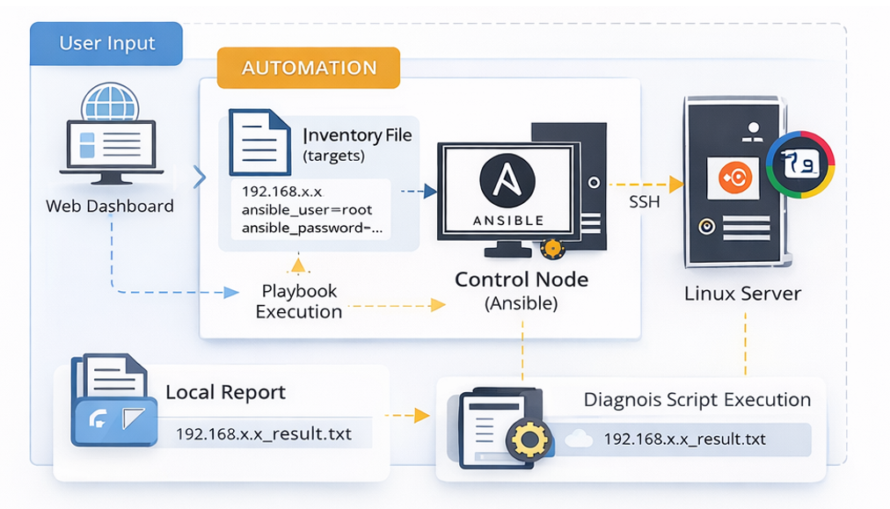
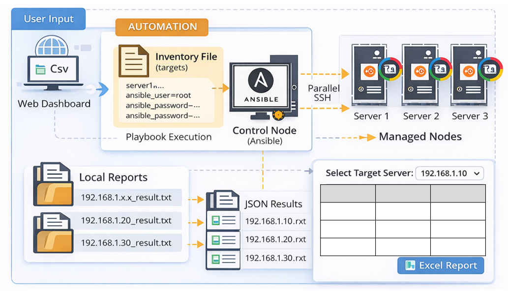
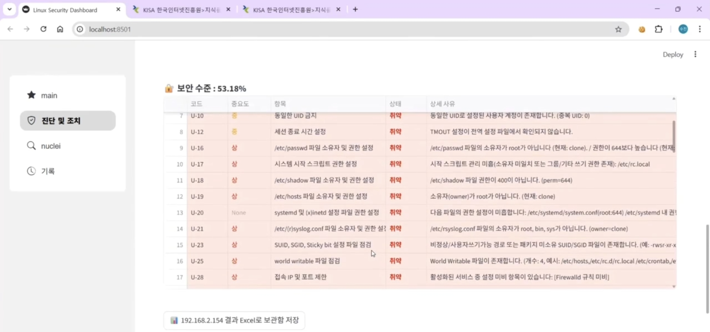
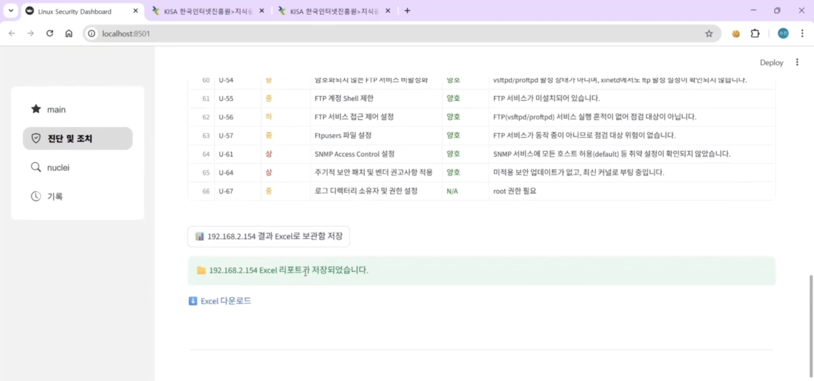
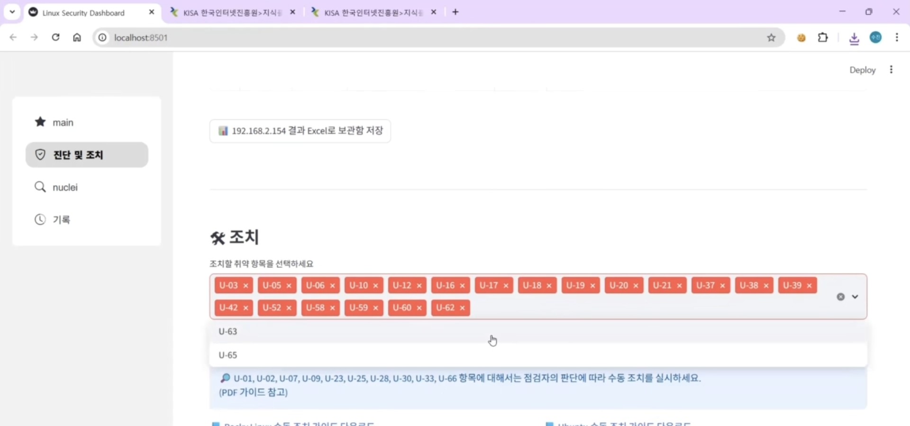
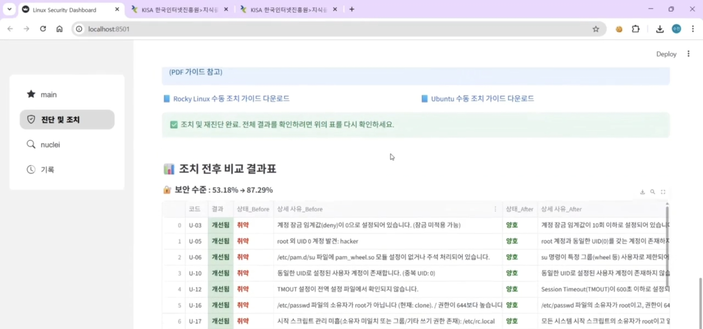
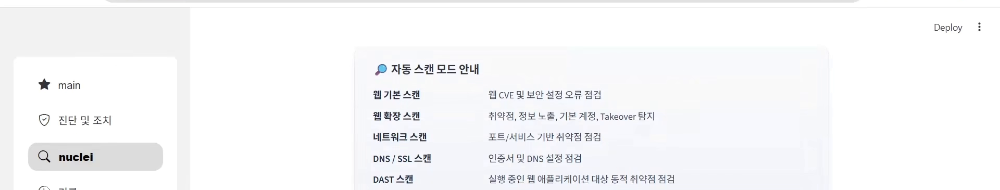
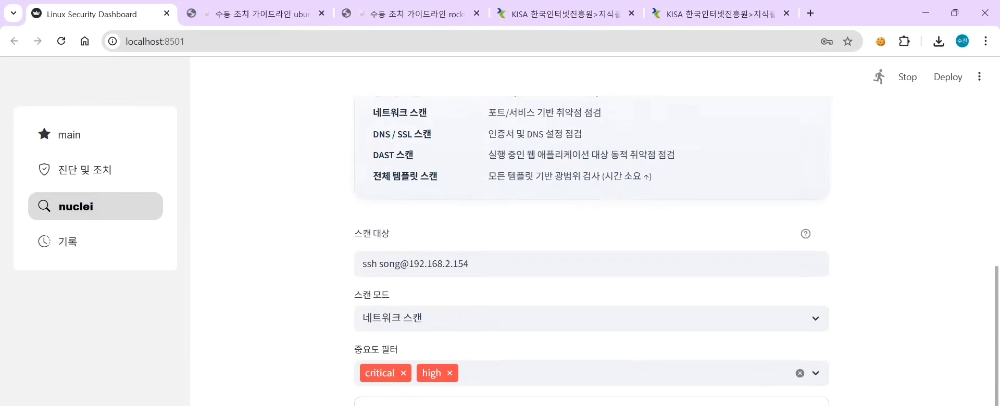
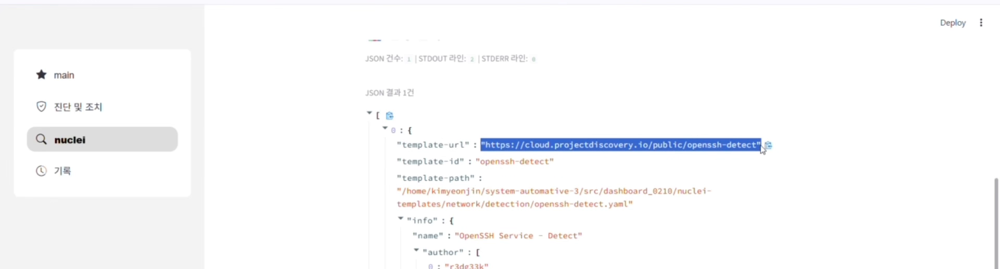

# 통합 Linux 취약점 진단·조치 자동화 시스템

Ansible 기반으로 다중 Linux 서버의 보안 취약점을 자동 진단하고, 선택적 조치까지 수행하는 웹 대시보드 기반 자동화 시스템입니다.

> 5인 팀 프로젝트로 진행된 시스템이며, 이 레포에는 전체 코드가 포함되어 있습니다. 담당 역할은 하단 [담당 역할](#담당-역할) 섹션에 명시했습니다.

**진행 기간**: 2026.02.04 ~ 2026.02.20 (3팀 치약좋지)

---

## 배경 및 목표

리눅스 활용이 급격히 증가하면서 보안 위협도 함께 확대되고 있습니다. 기업의 주요 서비스가 리눅스 기반 인프라 위에서 운영되는 만큼, 단 한 번의 취약점 노출도 큰 보안 사고로 이어질 수 있습니다. 실제로 일반 사용자 계정만으로 루트 권한을 탈취할 수 있는 취약점 사례가 보도되는 등, 인프라 보안의 중요성이 강조되는 상황입니다.

이 프로젝트는 **기업 환경에서 확장 가능한 취약점 진단·조치 자동화 시스템**을 목표로, 대량의 서버를 대상으로 OS를 자동 탐지하고 적절한 스크립트를 실행해 누구나 손쉽게 점검할 수 있는 환경을 구축했습니다.

---

## 프로젝트 개요

| 항목 | 내용 |
|---|---|
| **점검 대상 OS** | Red Hat 계열 Rocky Linux 9.7 / 10.1, Debian 계열 Ubuntu 24.04 |
| **점검 기준** | KISA 주요정보통신기반시설 기술적 취약점 분석·평가 방법 상세 가이드(2026), 총 67개 항목 |
| **개발 환경** | Control Node: Ubuntu 24.04 + Ansible, 대시보드: Streamlit, 점검 대상: VMware 가상 환경 |
| **코드 관리** | VSCode + GitHub |

점검 대상 OS는 초기 설계에서 다양한 리눅스 배포판을 고려했으나, Rocky Linux와 Ubuntu가 실무에서 가장 많이 사용되고 배포판이 달라도 진단 방식에 큰 차이가 없다는 점을 고려해 3개 버전으로 좁히고, 대신 조치·자동화 기능의 다양화에 집중했습니다.

---

## AS-IS & TO-BE

| AS-IS (기존 문제) | TO-BE (개선) |
|---|---|
| 관리자 개별 수동 진단과 수동 보고서 작성으로 소요시간 多 | 다중 서버 병렬 진단 + 보고서 자동 생성으로 소요 시간 단축 |
| 조치 후 시스템에 미칠 영향을 파악하기 어려움 | 선택적 자동/수동 조치 + 상세 가이드 병행으로 안정성 보장 |
| CLI 중심 운영으로 전체 현황 파악 어려움, 오타·설정 오류 위험 | Web UI 기반 대시보드로 운영 편의성 제공 |

---

## 시스템 아키텍처

### 개별 서버 진단



```
[ 사용자 ]
   ↓ 웹 대시보드에서 IP/계정 정보 입력 후 진단 버튼 클릭
[ Inventory 파일 자동 구성 ]
   ↓
[ Control Node: Ansible Playbook 실행 ]
   ↓ SSH 접속
[ 대상 Linux 서버: 진단 스크립트 실행 ]
   ↓ 결과는 대상 서버가 아닌 Control Node에만 저장 (정보 노출 최소화)
[ Control Node 로컬 저장 → 접근 권한 있는 점검자만 결과 확인 ]
```

### 다중 서버 진단



```
[ 사용자 ]
   ↓ CSV 파일(다수 서버의 IP/계정 정보) 업로드
[ Inventory 파일 자동 구성 ]
   ↓
[ Control Node: Ansible Playbook 실행 ]
   ↓ 여러 서버에 순차 SSH 접속
[ 각 서버 진단 → 결과는 Control Node에 서버별 파일로 저장 ]
   ↓
[ JSON 가공 → 웹에서 서버별 결과 조회 / Excel 보고서 출력 ]
```

핵심 설계 원칙은 **진단 결과를 대상 서버가 아닌 Control Node에만 저장**하는 것으로, 서버 내부에 점검 이력이 남지 않아 불필요한 정보 노출 위험을 최소화했습니다.

---

## 주요 기능

### 1. 진단 (Diagnosis)
- **개별 서버 진단**: IP/계정 정보를 직접 입력해 단일 서버 진단
- **다중 서버 진단**: CSV 파일 업로드로 여러 서버 일괄 진단
- OS 자동 식별 후 해당 OS에 맞는 진단 스크립트 실행, 서버별 보고서 개별 생성

### 2. 조치 (Remediation)
- **선택적 조치**: 67개 항목 중 19개는 수동 조치를 권장(운영 환경 영향 최소화를 고려), 나머지는 점검자가 원하는 항목만 선택해 조치 가능
- **자동 재진단**: 조치 완료 후 자동으로 재진단을 수행해 Before/After 비교표를 생성, 조치 전후 결과를 한눈에 확인 가능

### 3. 자동화 (Automation)
- Ansible 기반으로 대상 서버의 OS를 자동 식별, 조건부 분기로 해당 환경에 맞는 스크립트 자동 실행
- 진단 결과를 위험도 기준으로 정렬하고 색상 강조를 적용한 Excel 보고서 자동 생성

### 4. Nuclei 스캐너 연동
템플릿 기반으로 취약점을 탐지하는 오픈소스 자동화 스캐너를 추가 연동했습니다.
- YAML 기반 템플릿으로 보안 취약점 점검 규칙을 작성·커스터마이징 가능
- 전 세계 보안 전문가들이 공유하는 수천 개의 템플릿을 즉시 활용해 최신 취약점 대응
- HTTP, DNS, TCP, 파일 등 다양한 프로토콜 지원, CVE 코드·심각도 등 상세 정보 제공
- **스캔 모드 6종 제공**: 웹 기본/웹 확장/네트워크/DNS·SSL/DAST/전체 템플릿 스캔 중 목적에 맞게 선택
- **자동 스캔 / 명령어 직접 실행** 두 방식 지원, 중요도 필터(critical/high 등)로 결과 범위 조절 가능

---

## 시연

**취약점 진단** — 위험도별로 정리된 항목별 진단 결과 (보안 수준 53.18%)





**조치 항목 선택** — 자동 조치 가능 항목을 선택해 일괄 실행, 수동 조치 필요 항목은 별도 안내



**조치 후 결과** — 조치 및 재진단 완료 후 보안 수준 자동 비교 (53.18% → 87.29%)



**Nuclei 스캔** — 스캔 모드 안내 및 스캔 설정·실행 화면





**Nuclei 스캔 결과** — OpenSSH 서비스 탐지 등 취약점 상세 정보를 JSON 형태로 출력



---

## 향후 개선 방향

- **진단 대상 확장**: 현재는 Linux 중심 지원 → Windows, DB 등 비Linux 환경으로 확장
- **점검 항목 확장**: 현재 KISA 가이드 기반 항목으로 한정 → 가이드에 없는 신규 취약점·환경별 특수 설정까지 포괄
- 최종 목표: **IT 인프라 전 영역에 대한 통합 취약점 진단 및 자동 조치 시스템 구축**

---

## 사용 기술

- **자동화**: Ansible (Playbook, SSH 기반 원격 실행)
- **취약점 스캐너**: Nuclei (YAML 템플릿 기반 오픈소스 스캐너)
- **대시보드**: Streamlit
- **테스트 환경**: VMware (Rocky Linux 9.7/10.1, Ubuntu 24.04 가상 서버)
- **보고서 출력**: Excel (위험도 정렬, 색상 강조)
- **버전 관리**: Git, GitHub, VSCode

---

## 디렉토리 구조

```
system-automative-3/
├── app.py
├── requirements.txt
├── src/
│   ├── dashboard_0210/
│   │   ├── ansible.cfg
│   │   ├── check_playbook.yml
│   │   ├── remedy_playbook.yml
│   │   ├── styles.css
│   │   ├── scripts/
│   │   │   ├── check/          # 진단 스크립트 (Rocky 9/10, Ubuntu)
│   │   │   ├── remedy/         # 조치 스크립트 (Rocky 9/10, Ubuntu)
│   │   │   └── nuclei/         # Nuclei 스캐너 연동
│   │   ├── templates/
│   │   └── images/
│   └── guides/                 # 수동 조치 가이드라인 (Rocky/Ubuntu)
```

---

## 담당 역할

5인 팀 프로젝트 중 다음 부분을 담당했습니다.

- **진단 스크립트**: 일부 점검 항목(U-xx)에 대해 Rocky Linux, Ubuntu 전체 대상 OS용 진단 스크립트 작성
- **조치 스크립트**: Ubuntu 대상 조치 스크립트 작성
